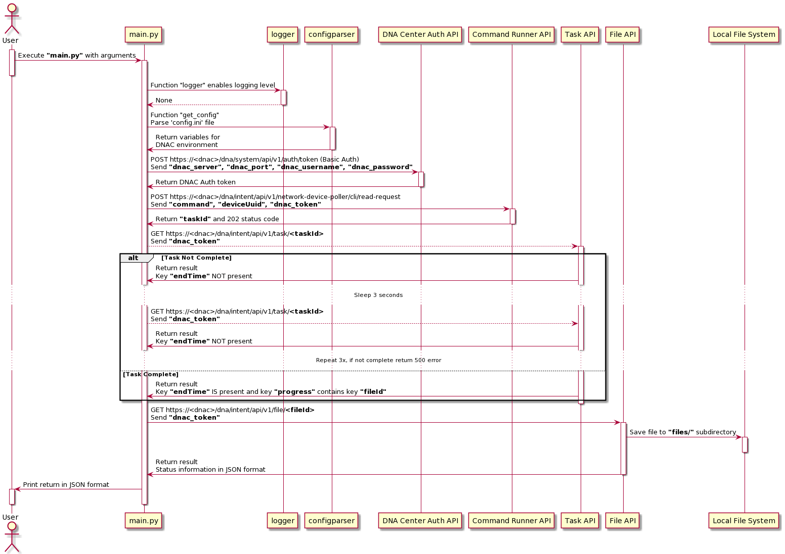

# DNA Command Runner APIs

This project code is used to send one or more CLI commands to the specified list of devices managed by DNA Center.  DNA Center allows a subset of read-only commands to be run via the Command Runner API; to obtain a list of valid top-level commands, run the ```main.py``` script with the argument ```--valid_commands```.

This project performs the following steps:

1. Execute process using the ```main.py``` script. This script accepts arguments for logging level, log file name, and details for the Command Runner API (```--commands``` and ```--deviceUuids``` are required for Command Runner requests).
   1. For a list of accepted arguments, execute the ```main.py``` script with the ```--help``` argument.
2. Import environment-specific DNA Center information from a ```config.ini``` file, including IP address, TCP port number, username and password.
3. Obtain a JSON Web Token (JWT) for API authentication.
4. If ```--valid_commands``` argument is given, script will return the list of valid top-level commands and exit immediately.  
5. Otherwise, the arguments provided to ```main.py``` will be sent to the Command Runner API which will generate an asynchronous **Task ID** on DNA Center that is returned to the script.
6. The script will check the status of the **Task ID** on DNA Center.  If the Task completes successfully, DNA Center will return a **File ID** to the script.
7. The script will use the **File ID** to request a download of the file.  The file is plain text saved in JSON format in the ```files/``` sub-directory and a status report is returned to the script containing the filename and location.

This code is broken into single purpose functions which can be imported and reused in other projects however, to run the entire package interactively, execute the ```main.py``` script.

#### UML Sequence Diagram



[PlantUML Link](http://www.plantuml.com/plantuml/uml/jLLDJmCt4BtdLuouqAv8be9wYH22fb2bfG6nuOQ4p7goMF6EjxPt8V--_c0TMH4LKjlB9futVfxtnXzNnZ9j-rPEM6sLXYU3UjAvaAX5nyZ2KSi4pRhT4J03Vxh_EIfLqw0Eu9rgSgnMj16D2vdFZ4K8v4c_hgvXWMHHmtLlt-3wOHbo_I3FNAYsPSJXiIT2dH8NBO-HF7lDp3Rb-44Etmg92VQ37BvJDPCX3jNEM6n3NeZULXFlbHYOnMYN_y3qChWpXviFh7i75KMohYZWNJXjJ3TzYsHD8eYESim9VT0HUaVdSDkJ0nNjlKPYhn8D-B6W1YGEA1Dbw8D6ssk2bI9qx1cKs4CtiWKQj2-nQKVFzE3x1iTnF1CaZc7ZVHh9ncx6dxt-nxZqmBI8PMwKVYRNvWKW3K8hyXQagX9HAYoqVWuFzzKQtgpjpBmiBpYn-h9qtzA4VfIi4-NmKybSRcdL5Wb--8KPKOVPFpvJXSHz3_p45uDwSCwTG1nsIjiqw1r8hCKzoenvLvgxjYMnSJlwpu7Ge2mWeGmdB9-KPAMD-hKsGHR9Zje8hQjZE-KuY1gddP8ITLbBKMfaVAhnhnwDtKkjum49GiAKfrxm92jKbsdQdvpqxq2TexNCR9VU3N3aS7Pw1iOosnke5K-xA-CRDJioV_BcyDlDD-JwTSgYk8ZhNHP5KlQLW72icRJX3woKXOLgEuaM9m0GeWU2D9fUEjF-m9rdHk9hqQ9NjxfVG-TW91kcpsQpIY9sS0u6QqNSk4X0_azr_r7bZzWXit3-SG9Y0wGir9_MW8vqFv-U0cgjj5U5qaGx_vM3osei8soLRKpej6fSrFWCPwDrN6R4_8sovADiHpNXcBKt7Pzm6N_JQy_glGxitzf9uGNm7xVIUCtFeM83WYS1gyPgJUbrcFwL2ut-oTmbbd5Yq9270lUNJbRnF0dQADsoS1SBWj-h-nN4Y6FCIqskF9bmdsX1DZRsO6h-j73yvwVd2edthVmR)
